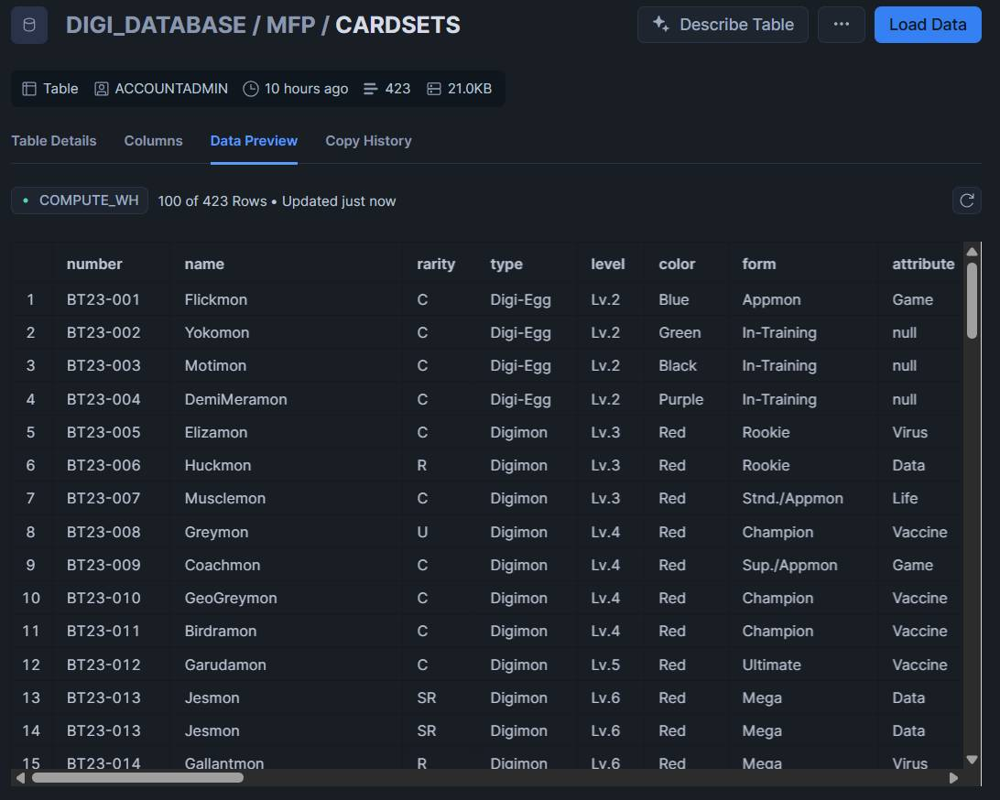
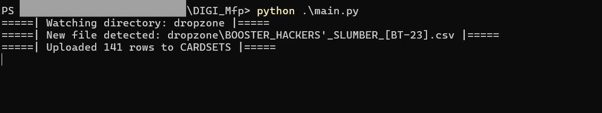

# 🃏 Digimon Card Set MFP  

This Python-based mini project simulates a Managed File Processing (MFP) Dropzone system. It continuously watches a directory for incoming flat files, validates their structure, and automatically uploads their contents into a Snowflake table.

---

## 📌 Features

- Monitors a dropzone directory in real-time for new .csv files using the watchdog library.
- Validates file structure (column count) with pandas.
- Uploads data to a specified Snowflake table using the official connector.
- Handles successful and failed files by moving them to processed/ or error folders.
- Configurable through a config.yaml file.

---

## 🆕 Updates / Changelog

### v1.0.0 – [2025-10-20]
- ✅ Initial release of the MFP Dropzone project.
- ✅ Implemented file watcher using watchdog.
- ✅ Added file validation with pandas.
- ✅ Integrated Snowflake upload functionality with snowflake-connector-python.
- ✅ Introduced modular OOP structure (4 main classes).
- ✅ Added YAML-based configuration and environment setup instructions.

---

## 📚 TODOs

- [ ] Implement unit testing using pytest.
- [ ] Add logging and error-tracking using Python’s logging module.
- [ ] Extend validation to support additional file formats (e.g., .txt).

---

## 🔧 Requirements

- Python 3.9+
- Libraries:
  - `pandas`
  - `watchdog`
  - `pyyaml`
  - `snowflake-connector-python`

Install dependencies:
```bash
pip install -r requirements.txt
```

---

## 🚀 How to Use

- Configure Snowflake credentials and table details in `config.yaml`.
- Then run the script:
```bash
python main.py
```
- Drop a .csv file into the dropzone/ folder

---

## 🧠 How It Works

1. The Watcher monitors the dropzone/ directory for new files.
2. When a file appears:
    - The Validator checks its structure using pandas.
    - If valid, the Uploader pushes data into the configured Snowflake table.
    - The Processor orchestrates file movement to processed/ or error/.
3. Configuration (credentials, table name, etc.) is handled via config.yaml.

---

## 📁 Example Output

**DATA UPLOADED IN SNOWFLAKE TABLE**


---

## 🖼️ Screenshots



---

## 🗃️ Project Structure

Project structured for better modularity and maintainability. 
```
DCG_MFP/
├── assets/
├── dropzone/
│ └── .gitignore
├── modules/
│ └── __init__.py
│ └── uploader.py
│ └── watcher.py
│ └── validator.py
│ └── processor.py
├── main.py
├── config-template.yaml
├── .gitignore
├── LICENSE
├── README.md
└── requirements.txt
```

---

## 🤝 Contributing

This is a personal portfolio project and is not currently accepting external pull requests.
However, feel free to fork the repository, experiment, and adapt it for your own learning or demonstration purposes.

---

## 📄 License

GLP License – see the [LICENSE](LICENSE) file for details.

---

## ⚠️ Disclaimer

This project is for educational and demonstration purposes only.
It is not intended for production environments. All Snowflake credentials and datasets should be handled securely and responsibly.